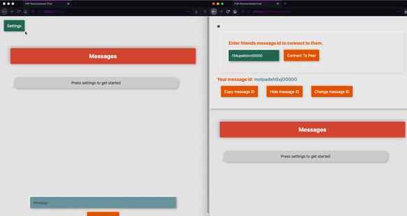
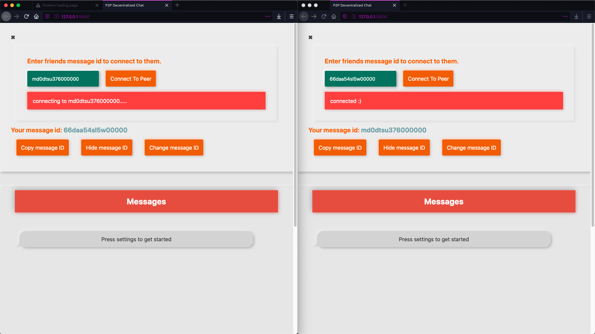
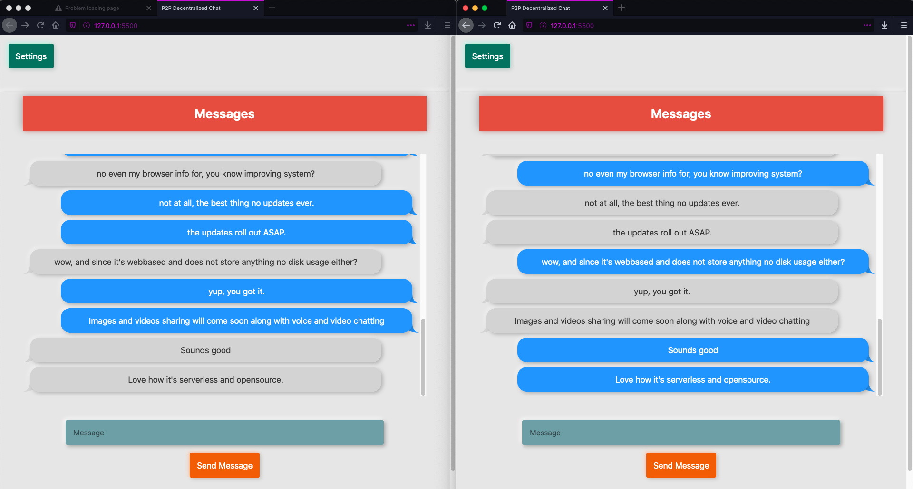

# Decenchat
Awesome Opensource Decentralized chat, using peer to peer connection,
no stinky server in between chat system using web RTC system. 

##   

---
Build from the ground up with privacy in mind,
requires 16char key exchange between host for proper encryption.

---
> #### Uses '2FA' authentication. User can send messages only if they have others message id.
>
> 

---
> #### Has a mordern and simple UI
>
> 

- Security features
  - XSS protection
  - HTTPS secured
  - No creds are stored *even for "quality purposes"*
  - Fully opensource code
  - Serverless *Static*
 
- Features
  - > Data sent between the two peers do not touch any other servers, so the connection speed is limited only by the upload and download rates of the two peers. This also means you don't have the additional latency of an intermediary server.

  - p2p connected
  - data is not stored anywhere except with the user
 
 
 ---
 
- To do
  - Add image/video sending feature.
  - Make the UI more clean
  - Write DOC.
  - Add voice / video call feature
  - Add 'Accessibility'
  
  

 
  
